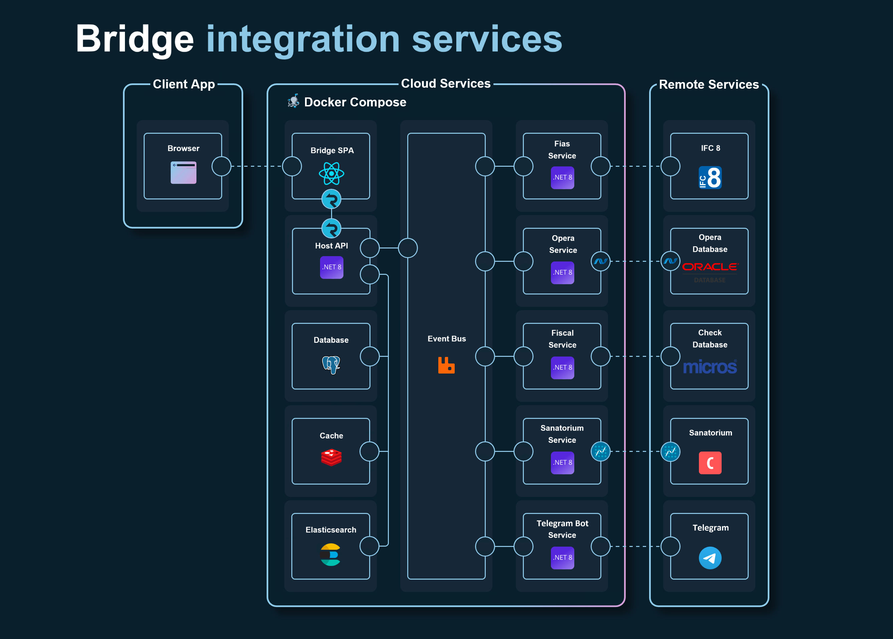

# Bridge integration services

Система интеграции «Oracle Hospitality OPERA PMS» и «Sanatorium» с использованием микросервисной архитектуры.



## Запуск

```sh
git clone https://github.com/ivankopanyov/Bridge.git
cd Bridge
docker-compose build
docker-compose up -t
```

Откройте в браузере http://localhost
